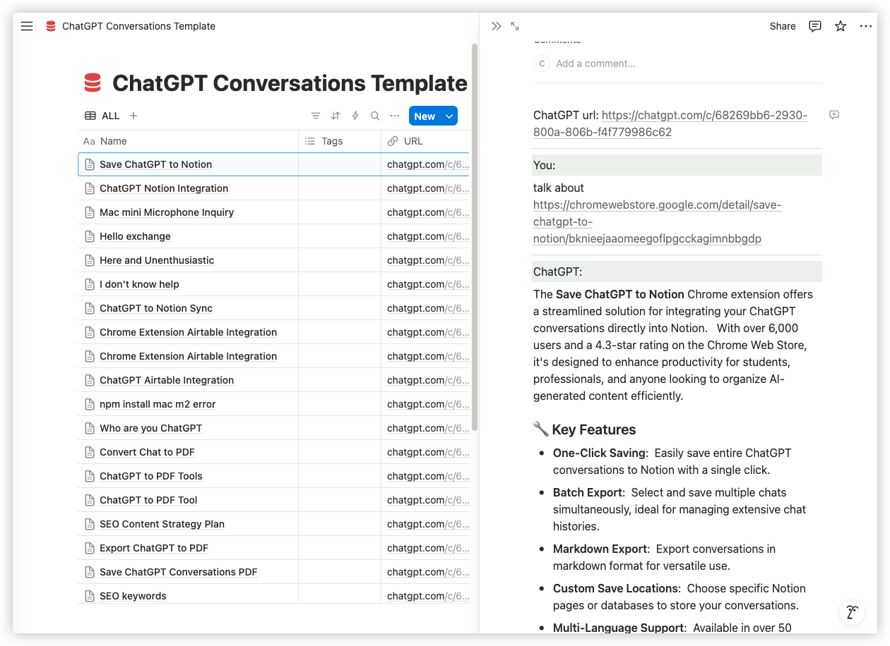
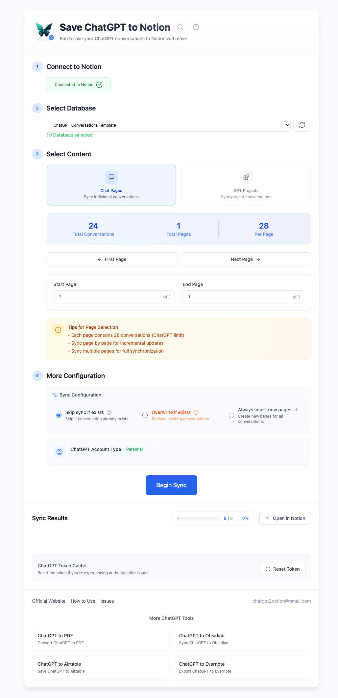

<div align="center">

# ChatGPT to Notion

### Save ChatGPT conversations to Notion — complete, organized, and reusable.

Export conversations, images, files, code, tables, Markdown, LaTeX, Deep Research, Projects, Group Chats, archived chats, and more.

**One chat, selected turns, selected conversations, or your wider ChatGPT history.**

[Website](https://chatgpt2notion.com) ·
[Changelog](https://chatgpt2notion.com/docs/chatgpt-to-notion/changelog/) ·
[Report an Issue](https://github.com/joysey/chatgpt-to-notion/issues)

</div>

---

## ✨ Turn your ChatGPT history into a Notion knowledge base

ChatGPT to Notion helps you move valuable AI conversations out of the chat sidebar and into a structured, searchable Notion workspace.

Use it to save:

- a single conversation,
- selected questions and answers,
- selected conversations in batch,
- recent or complete archived chats,
- ChatGPT Projects,
- Deep Research reports,
- Group Chats,
- or recent conversations automatically with Auto Sync.

The goal is simple:

> **Keep the useful work you create with ChatGPT somewhere you can search, organize, share, and revisit.**

---

## 📸 Screenshots

### Save a ChatGPT conversation



### Batch export conversations



> Screenshots may vary slightly as the extension interface continues to improve.

---

# 🚀 What you can do

## 💬 Save complete ChatGPT conversations

Export the full conversation while preserving useful context such as:

- Conversation title
- Message order
- User and assistant messages
- Source URL
- Conversation time
- Project information when available

Your saved Notion page stays readable and useful instead of becoming a plain text dump.

---

## 🖼️ Export images and file attachments

Supported ChatGPT images and files can be exported directly into Notion.

This helps preserve conversations that contain more than text, instead of leaving broken references or placeholders behind.

Useful for:

- image-based discussions,
- uploaded documents,
- research material,
- generated files,
- project assets.

---

## 🧱 Preserve rich formatting

The extension keeps ChatGPT content structured when moving it into Notion.

Supported content includes:

- Headings
- Paragraphs
- Bulleted and numbered lists
- Quotes
- Tables
- Links
- Inline code
- Code blocks
- Markdown structure
- Images
- Supported file attachments

---

## ∑ LaTeX and math expressions

ChatGPT conversations containing mathematical expressions can be exported while preserving both inline and display equations.

Formulas are converted into **native Notion equation blocks / inline equations** when supported.

For example:

```text
θₜ₊₁ = θₜ − η∇θL(θₜ)
````

This is especially useful for:

* mathematics,
* machine learning,
* statistics,
* physics,
* engineering,
* academic notes.

---

## ⚡ One-click saving

Save the current ChatGPT conversation directly from the extension popup.

You can also enable an optional compact shortcut on ChatGPT pages for faster access.

---

## 🎯 Select only the answers you need

You do not always need the whole conversation.

Selective export lets you save only the relevant Q&A turns or Group Chat messages.

This is useful when a long conversation contains only a few sections worth keeping.

---

# 📚 Batch export your ChatGPT history

ChatGPT to Notion is not limited to one conversation at a time.

You can export multiple conversations into Notion in one workflow.

## Selective batch export

Choose exactly which conversations you want to export.

The selection workflow includes:

* Select all
* Clear selection
* Load next page
* Load all
* Reload
* Paginated conversation loading

This gives you more control than exporting everything blindly.

---

## Batch backup

Export multiple ChatGPT conversations to build a searchable backup inside Notion.

Useful when you want to:

* migrate historical conversations,
* create a personal knowledge archive,
* preserve important work,
* organize chats by project,
* keep AI research outside ChatGPT.

---

# 🔄 Auto Sync

Auto Sync can automatically back up recent ChatGPT conversations on a schedule.

Choose a sync interval and let the extension keep recent conversations available in Notion without manually exporting each one.

This is useful for people who use ChatGPT every day and want a continuous backup workflow.

---

# 🗄️ Archived Chats

Archived conversations do not have to stay hidden inside ChatGPT.

You can export:

* the latest archived chats,
* or your complete archived history.

Archived conversations can also be tagged appropriately in Notion so they remain distinguishable from active chats.

---

# 📁 ChatGPT Projects

Save conversations associated with ChatGPT Projects while keeping available project context.

The exported page can include the project name in your Notion database, making it easier to group related conversations later.

This works well for:

* product development,
* research projects,
* client work,
* writing projects,
* study topics,
* ongoing investigations.

---

# 🔬 Deep Research

ChatGPT Deep Research often produces much richer documents than a normal chat response.

The extension supports current Deep Research export structures and can preserve research-heavy content such as:

* formatted reports,
* citations and links,
* structured sections,
* research documents,
* related generated content.

Where appropriate, large research documents can be saved as linked Notion child pages.

---

# 👥 Group Chats

ChatGPT Group Chats can also be preserved in Notion.

The extension keeps:

* message order,
* participant names,
* selected messages,
* conversation context.

You can export the full Group Chat or only the messages worth keeping.

---

# 📖 Long conversation support

Long ChatGPT conversations can become difficult to export reliably because of their size and complexity.

ChatGPT to Notion includes handling designed for larger chats, including:

* more reliable long-content processing,
* linked page splitting when necessary,
* improved recovery from interrupted exports,
* clearer export progress,
* better handling of complex formatting.

The extension popup keeps both progress and the final result visible so you can see what happened.

---

# 🔁 What happens when you export the same conversation again?

You stay in control.

The extension provides different strategies depending on how you want your Notion archive to behave.

## ✅ Keep completed pages

Skip conversations that have already been successfully stored.

Useful for large backup jobs where you only want to process new conversations.

---

## 🔄 Update the existing page

Refresh the existing Notion page while keeping the same page link.

The extension can update:

* page properties,
* conversation content,
* current conversation data.

This is useful when a ChatGPT conversation has continued since the previous export.

---

## 📄 Always create a copy

Save another version without changing the existing page.

Useful if you intentionally want snapshots or multiple versions.

---

## 🗑️ Deleted pages stay deleted

If a previously exported Notion page has been moved to Trash, the extension will not silently restore it.

Instead, a new active page is created when the conversation is exported again.

---

# 🗂️ What gets organized in Notion?

The extension can populate useful properties in your target Notion database.

| Property        | Purpose                                             |
| --------------- | --------------------------------------------------- |
| **Title**       | Current ChatGPT conversation title                  |
| **URL**         | Source conversation link and repeat-export matching |
| **ChatTime**    | Conversation date and time                          |
| **Tags**        | Optional labels and useful export tags              |
| **ProjectName** | Associated ChatGPT Project when available           |

The conversation itself is saved as structured Notion page content.

This makes it possible to create your own:

* project views,
* research libraries,
* study databases,
* AI knowledge bases,
* content archives,
* personal second brain.

---

# 🎯 Who is it for?

## 🔬 Researchers

Keep AI-assisted research, Deep Research reports, source links, and supporting files together.

## 🎓 Students

Organize explanations, formulas, study notes, exercises, and learning resources.

## 💼 Professionals

Preserve decisions, drafts, analysis, troubleshooting, and important work discussions.

## 👥 Teams

Save useful Group Chat discussions, ideas, and outcomes.

## ✍️ Writers and creators

Build a reusable library of:

* ideas,
* drafts,
* prompts,
* research,
* editing discussions,
* content experiments.

## 🧠 Knowledge-management users

Turn valuable ChatGPT history into a searchable Notion knowledge base instead of letting useful conversations disappear in an endless sidebar.

---

# 📝 How to use

## 1. Connect Notion

Authorize your Notion workspace through the extension.

## 2. Choose your database

Select the Notion database where conversations should be stored.

## 3. Choose what to save

Export:

* Current conversation
* Selected turns
* Selected batch conversations
* Multiple conversations
* Archived Chats
* Projects
* Group Chats

Or enable Auto Sync.

## 4. Choose repeat-export behavior

Decide whether previously exported conversations should be:

* skipped,
* updated,
* or duplicated.

## 5. Export

Start the export and follow the progress in the extension popup.

When complete, open the finished page directly in Notion.

---

# 🧠 Build a second brain from your ChatGPT history

A valuable ChatGPT conversation is more than temporary chat history.

It may contain:

* research you spent hours developing,
* an important technical solution,
* a business decision,
* a useful explanation,
* a writing draft,
* project knowledge,
* files and images,
* ideas you want to revisit months later.

ChatGPT to Notion helps move that knowledge into a system you can continue using.

```text
ChatGPT
   ↓
ChatGPT to Notion
   ↓
Notion
   ↓
Search · Organize · Connect · Reuse
```

**Exporting is only the first step.**

The real goal is to keep useful AI-generated knowledge accessible long after the original conversation is over.

---

# 🔄 Recent updates

Full changelog:

**[https://chatgpt2notion.com/docs/chatgpt-to-notion/changelog/](https://chatgpt2notion.com/docs/chatgpt-to-notion/changelog/)**

<details open>
<summary><strong>2026-09-12 — LaTeX + Selective Batch Export</strong></summary>

* Added LaTeX and math expression support.
* Inline and display formulas can be preserved as native Notion equations.
* Added selective batch export.
* Choose specific conversations before exporting them together.
* Improved batch selection controls and paginated loading.

</details>

<details>
<summary><strong>2026-08-24 — Popup stability</strong></summary>

* Fixed an issue where the extension popup could auto-flicker for some users.

</details>

<details>
<summary><strong>2026-07-29 — Images, files, long chats, and repeat exports</strong></summary>

* Added direct export of supported ChatGPT images and file attachments.
* Export progress and final results remain visible in the popup.
* Repeat exports can refresh the same Notion page without changing its link.
* Deleted pages are not silently restored; a new active page is created.
* Improved reliability for long conversations.
* Improved recovery from interrupted exports.
* Improved handling of large content and complex formatting.
* Refreshed popup and settings navigation.
* Added an optional compact ChatGPT page shortcut.

</details>

<details>
<summary><strong>2026-07-03 — Archived Chats</strong></summary>

* Added Archived Chats synchronization.
* Export the latest archived page or complete archived history.
* Improved conversation-count loading.
* Added faster estimated counts and exact refresh.
* Archived exports receive an `Archived` tag in Notion.

</details>

<details>
<summary><strong>2026-06-02 — Deep Research</strong></summary>

* Added support for the latest ChatGPT Deep Research format.
* Deep Research reports can be saved as linked Notion child pages.
* Improved handling of research-heavy conversations and tool-generated documents.

</details>

<details>
<summary><strong>2026-01-16 — Auto Sync</strong></summary>

* Added Auto Sync for recent ChatGPT conversations.
* Added flexible scheduled synchronization intervals.

</details>

<details>
<summary><strong>2025-12-15 — Group Chats</strong></summary>

* Added ChatGPT Group Chat export.
* Added selective Group Chat message export.
* Preserved participant names and message order.

</details>

---

# 📌 Links & support

### Website

[https://chatgpt2notion.com](https://chatgpt2notion.com)

### Documentation & changelog

[https://chatgpt2notion.com/docs/chatgpt-to-notion/changelog/](https://chatgpt2notion.com/docs/chatgpt-to-notion/changelog/)

### GitHub Issues

[https://github.com/joysey/chatgpt-to-notion/issues](https://github.com/joysey/chatgpt-to-notion/issues)

Please search existing issues before opening a new one.

When reporting a problem, it helps to include:

* browser version,
* extension version,
* export mode,
* approximate conversation size,
* screenshot of the error,
* whether the problem affects one conversation or many.

Please remove private or sensitive conversation content before sharing screenshots or examples.

### Email

**[chatgpt2notion@gmail.com](mailto:chatgpt2notion@gmail.com)**

---

## Disclaimer

ChatGPT to Notion is an independent tool and is not affiliated with or endorsed by OpenAI or Notion.

Product names and trademarks belong to their respective owners.

